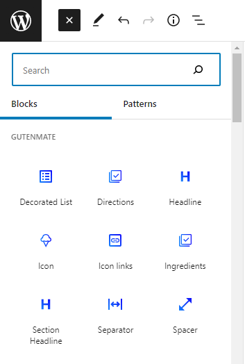

# Regular Blocks

Gutenmate comes with many blocks and is ease to use. All blocks of Gutenmate have a blue icon. You can search by typing **gutenmate** or the name of the block.

## Common Block Options

Gutenmate provides a common option for blocks. To make dealing with block styling and rendering easier.

### Block appearance options

These options are for configuring the block's appearance style. The options are as follows:

* **Radius** Enter a number of pixels to adjust the radius of the block's corner. If you need to adjust a specific corner, click the **Chain** button and enter a number of pixels into the corresponding corner.
* **Shadow** Select a shadow of the block. If you need to create it, Click the **Cog** button and enter values to create your own shadow.
* **Typography** Select a typography of the block. If you need to change the typography property (e.g. font weight, font size), Click the **Custom** button and change the desired property. This option supports responsive value.

### Block container options

These options are for configuring the block's container. The options are as follows:

* **Margin top** Select a margin size or click the **Custom** button to enter the desired size. This option supports responsive value.
* **Margin bottom** Select a margin size or click the **Custom** button to enter the desired size. This option supports responsive value.
* **Padding** Enter a number of pixels to adjust the padding of the block. If you need to adjust a specific side, click the **Chain** butto and enter a number of pixels into the corresponding side. This option supports responsive value.

### Block color options

These options are for configuring the block's container. Some blocks has their own color option placed in the other section. The color options may vary depending on each block.

### Block visibility options

These options are for configuring the visibility ob the block. The options are as follows:

* **Hide on Desktop** Enable this option to hide this block when displaying on desktop (large browser size)
* **Hide on Tablet** Enable this option to hide this block when displaying on tablet (medium browser size)
* **Hide on Phone** Enable this option to hide this block when displaying on phone (small browser size)
* **Conditional display** This option is to control the rendering of the block from the server side. Select the **Visible** or **Hidden** option to start configuring the conditions.