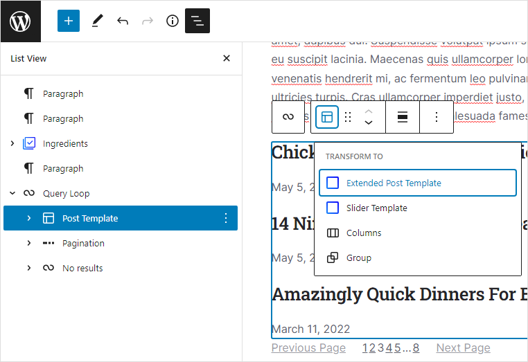
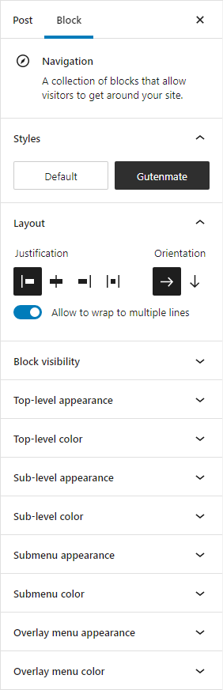
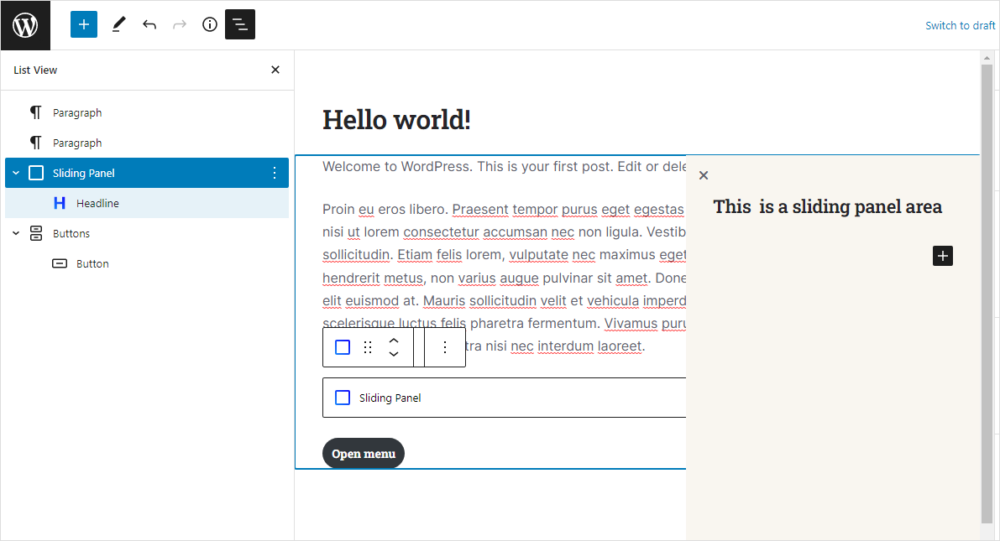
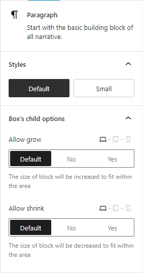

# Specialty Blocks

There are advanced blocks for creating great layouts. This section explains how to deal with it.

## Query loop block

The query loop block is used for displaying a post listing. Gutenmate provide an extra option for the block in the section **Extended filters**. The options are as follows:

1. **Post filter** Select the filter you want to apply to this query. Some filter may override the block settings.
2. **Only posts within las N days** Enter the number of days to get the post from. Enter **0** to disable the restriction. It is useful when creating a section to display popular posts within a certain time range.
3. **Random order** Enable radomized order result. The post order will not be sorted by date as usual, but randomized. This option will be applied on the front end and may affect the performance.

## Extended post template block

The post template block is used in the Query block for displaying post. The extended post template block is a powerful way to control the display of posts in the query block, such as displaying the first post as a large layout and the other posts displayed in a small layout.

You can add the extended post template block inside the query block. Another way to use the extended post template block is to transform the post template block to an extended post template block.

The options to control the display of posts are in the **Post Display** section.

## Navigation block

The navigation block is a block of gutenberg but the Gutenmate plugin provides more options for easier styling. To activate these options, Go to the **Navigation** block options and select the style named **Gutenmate**. You will see a lot of options added.

## Mega menu block

The mega menu block is for creating a complex sub-menu. Which allows you to add any blocks to the sub-menu in order to create your own layout. Follow the below steps to learn how to create a mega menu.

1. In the post edit page, Click the **Plus** button to add a new block and add the **Mega menu** block.
2. Click **Add link** and select a page to link to.
3. Once a link is added, an empty box appears below the link. Click the **Plus** button inside the box to add a sub-menu.
4. Now you can add any blocks to create your own layout.

## Sliding panel block

The sliding panel block is used for creating off-canvas menus (e.g., mobile menus). Follow the below steps to learn how to create a sliding panel.

1. In the post edit page, Click the **Plus** button to add a new block and add the **Sliding panel** block.
2. Once the block is added, there is no area at the block position, but the actual block area is on the top-right of the screen. This is because the sliding panel block will display on the entire site area, not on the block position.
3. Go to the block option. Click the **Advanced** section and enter a specific ID into the **HTML anchor** option. This ID will be used to show or togggle the sliding panel.

4. Now the sliding panel is ready to display. You may add some blocks to the sliding panel block.
5. Next, Click the **Plus** button to add a new block and add the **Buttons** block. We will use this block to toggle the sliding panel.
6. Click the button block and click the **Link** button on the block toolbar.
7. Enter an ID of sliding panel (same ID as entered in the **HTML anchor** option ), prefixed with sharp symbol. Example `#my-sliding-panel`
8. Done. The sliding panel will be shown when you click the button.

## Box block

The box block is a block for grouping blocks together. It allows you to change the direction of block flow and alignment (in the same way as Flexbox).

Any block inside the box block will have an extra option in the **Box's child options** section. These options allow you to control the growing or shrinking size of the block.

## Popup search block

The popup search block works in the same way as the **Sliding panel** block. All blocks inside will be hidden and show up as a popup box when triggered. Follow the below steps to learn how to create a popup search block.

1. In the post edit page, Click the **Plus** button to add a new block and add the **Popup search** block.
2. The block will be added with search block. You can configure the style as you want.
3. Next, Click the **Plus** button to add a new block and add the **Buttons** block. We will use this block to toggle the popup search block.
4. Click the button block and click the **Link** button on the block toolbar.
5. Enter `#search` in the **HTML anchor** option.
6. Done. The popup search block will be shown when you click the button.
