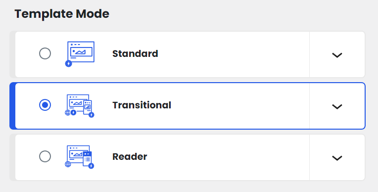
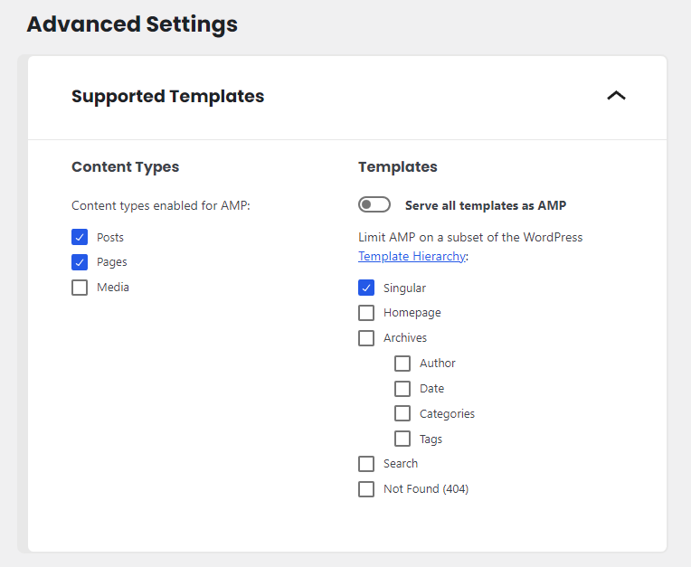

[revision 3]: <> (Add Ads feature)

# Website configuration

${var.theme-name} supports full site editing, enabling you to modify many different elements of the website including changing the logo, updating the navigation menu, or developing your own post template.

## Full site editing

Full Site Editing (or "FSE") is a group of connected capabilities that enables you to use blocks to update your entire website. As a result, there are more applications where you may use the Block Editor's comfortable and flexible experience.

To start making changes to the website, navigate to `Appearance > Editor`

?> **TL;DR** Browse through the **Templates** and **Template parts** menu in the full site editor and make any changes you wish! You can revert the changes at any time.

## Creating homepage

1. Navigate to `Appearance > Editor > Templates`.
2. Click **Add new** button and choose **Front Page**.
3. Now you will see the blank editor. For quick adding, paste the below code into the editor.
4. To add a ready-to-use template, click the button `+` and add a **Template Part** block. After that, Click the button `Choose` and select a template part that has a name prefixed with **Home**.
5. Click the button `Save` and go to your website to check the result.

```html
<!-- wp:template-part {"slug":"home-main","theme":"${var.theme-slug}"} /-->
```

## Editing logo

0. Navigate to `Appearance > Editor > Template Parts` and choose any template that begins with **Home** or **Header**.
0. In the template editor, Click **Site logo** block and click **Replace**. Choose or upload new website logo.
0. Click **Save**.
0. Now all templates that use the **Site logo** block will be updated automatically except some templates that has own logo image block. You may check again in the template editor.

## Editing primary navigation

0. Navigate to `Appearance > Editor > Template Parts` and choose **Navigation – Primary**.
0. To add top-level menu item, Click on the **Mega menu** block and click the black **Plus** icon.
0. To add sub-level menu item, Click on the top-level menu item and click the white **Plus** icon.
0. You can add any block to decorate the sub-menu, such as text, image or grid.
0. Click **Save**.

## Editing mobile navigation

0. Navigate to `Appearance > Editor > Template Parts` and choose **Popup - Entire site**.
0. Click on the **Sliding Panel** block and click the **Navigation** block.
0. Edit the navigation block to have your mobile navigation.
0. Click **Save**.

## Editing social links

1. Navigate to `Appearance > Editor > Template Parts` and choose any template that begins with **Home** or **Header**.
2. Locate the **Icon links** block, which is used to display social links, in the template editor.
3. To add new social link, Append an **Icon link** block into **Icon links** block.
4. Click **Save**.

## Editing social share

1. Navigate to `Appearance > Editor > Template Parts` and choose any template that begins with **Single post**.
2. Locate the **Post share** block, which is used to display social share links, in the template editor.
3. Change the social links in the **Social networks** option of the block.
4. Click **Save**.

## Adding author social networks

You can add social networks for authors. The information will be shown in the **About author** block.

1. Navigate to `Users > All users` and click the user you want to edit.
2. Or navigate to `Users > Profile` for editing the current user.
3. At user edit page, scroll down to the **Additional options** section.
4. Enter information about a social network. You can sort the order of links by clicking the arrow button.
5. Click the **Update user** button.

## Editing widgets & sidebar

There are no longer any widgets like there were in classic-themes because this theme offers full site editing.

In the full site editor, there is a sidebar template that you can edit or create your own sidebar.

1. Navigate to `Appearance > Editor > Template Parts` and choose a template named **Sidebar** or create your own template by clicking the **Add new** button and select the **Sidebar** area.
2. Add any block you want to the sidebar template.
3. Click **Save**.
4. You can use the sidebar template on any page by adding a Template part block and choosing the desired sidebar.

## Customize post & page templates

1. Navigate to `Appearance > Editor > Templates`.
2. To customize post template, Select a template that begins with **Single post**.
3. To customize page template, Select a template that begins with **Single page**.
4. Modify the template as you wish.
5. Click **Save**.

## Customize review template

1. Navigate to `Appearance > Editor > Template Parts` and select a template that begins with **Review**.
2. Modify the **Review template** block as you wish.
3. Some review element blocks is avaialable only inside the review template block. Please click the **Add block** button inside of the review template block instead of using the add block button in the editor toolbar.
4. Click **Save**.

## Customize recipe template

1. Navigate to `Appearance > Editor > Template Parts` and select a template that begins with **Recipe**.
2. Modify the **Recipe template** block as you wish.
3. Some recipe element blocks is avaialable only inside the recipe template block. Please click the **Add block** button inside of the recipe template block instead of using the add block button in the editor toolbar.
4. Click **Save**.

## Theme options

Navigate to the **Gutenmate** menu in the admin area. This section contains the following options.

- **Typography** - For configure a font family and font weights to be loaded.
- **Image Sizes**  - For configure an image sizes used in this theme.
- **Post Sharing** - For configure an options of post share block.
- **Post Views** - For configure an options of post view block.
- **Advertisement** - For configure an options of advertisement.
- **SEO Optimization** - For configure a generation of SEO. You can disable if you are currently use a third-party plugin.
- **Icon Sets** - For configure an icon list that can be used in this site. Enables more icon sets will be slowdown the website.
- **Custom Scripts** - For adding a custom scripts
- **Custom Styles** - For adding a custom styles (CSS)

## Enabling AMP

AMP is a powerful tool which applies many optimizations and best practices automatically on your site, making it easier for you to achieve good page experience for your visitors. Please follow the below instruction to enable the AMP page.

1. Install and activate the [AMP plugin](https://wordpress.org/plugins/amp/).
2. Navigate to `AMP > Settings` and set the **Template mode** option to **Transitional**.

3. In the **Advanced Settings** section, Uncheck the option **Serve all templates as AMP** and only the **Singular** box should be checked.


## Editing AMP templates

Navigate to `Appearance > Editor > Template Parts`. All templates that begins with **AMP** is for displaying AMP page as the following

- `AMP - Page` for displaying individual page.
- `AMP - Single Post` for displaying individual post.

In case you need to create a template for other pages such as home page or archive page. Click the `Add New` button and enter template name. All available template names as the following

- `AMP - 404` for displaying the 404 page.
- `AMP - Search` for displaying the search page.
- `AMP - Front page` for displaying the front page.
- `AMP - Archive` for displaying the archive page.
- `AMP - Attachment` for displaying the attachment (media) page.

After created the new AMP template, Navigate to `AMP > Settings` and recheck the supported templates in the **Advanced Settings** section.

## Adding Ad Code

To add an ad code for all slot in website without editing the template, Please navigate to the **Gutenmate** menu in the admin area and click the section **Advertisement**. The **Ad Code Preset** option can be found in this section.

Just click the ad size you want to insert the code and paste into the textbox.

Click the button `Save` and go to your website to check the result.
